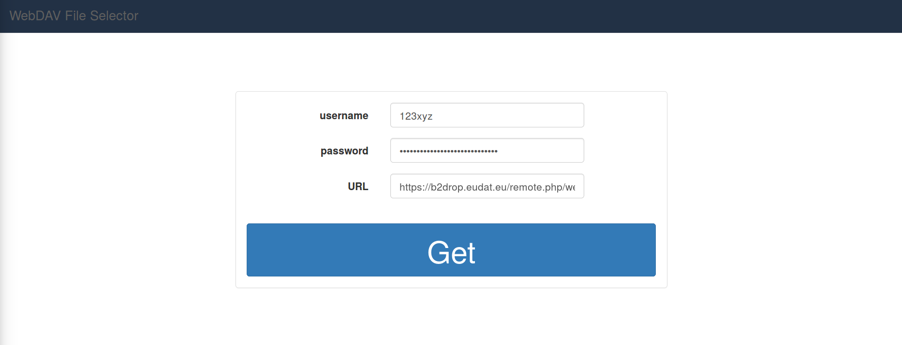

# webdav-fileselector

A Laravel package for showing and selecting files and folders of a WebDAV server.

## Features

- Retrieve a list of files and folders from a WebDAV server
- Use WebDAV API: *propfind*
- No mounting
- Fast
- Provides a client template


## Dependencies

- Laravel 5.5.*
- PHP 7.0
- cURL extension enabled

## Included libraries

- jQuery 3.3.1
- bootstrap 3.3.7
- font-awesome
- hummingbird-dev/hummingbird-treeview

This means that these libraries (or parts of them) are included in the
webdav-fileselector package. Thus no download / installation of these libraries is needed.

## Getting started
### Installation

Install via composer and run the command below in the root of your project:

```bash
composer require hummingbird-dev/webdav-fileselector

```

Add the following under *autoload* to your composer.json (that one in your projects root directory):

``` php
...
"autoload": {
   ...
   "psr-4": {
      "App\\": "app/",
      "HummingbirdDev\\WebdavFileselector\\":"vendor/hummingbird-dev/webdav-fileselector/src/"
   }
   ...
},

```

Update *composer* from the root of your project:

```bash
composer update

```

Publish resources from your root folder:

```bash
php artisan vendor:publish --provider="HummingbirdDev\\WebdavFileselector\\WebdavFileselectorServiceProvider"

```


## Usage

Start a local development server

``` php
php artisan serve

```

and navigate to http://localhost:8000/webdav-fileselector

You will see the client template, which can be edited at "/resources/views/hummingbird-dev/client.blade.php".



Now insert your WebDAV username and password as well as the URL of the
WebDAV server. In this example I'm connecting with B2DROP from EUDAT, i.e. https://b2drop.eudat.eu/remote.php/webdav/.

After clicking on *Get* the *webdav-fileselector* will grab a list of
files and folders of your WebDAV storage. The [hummingbird-treeview](https://github.com/hummingbird-dev/hummingbird-treeview) package is used to display the data.


