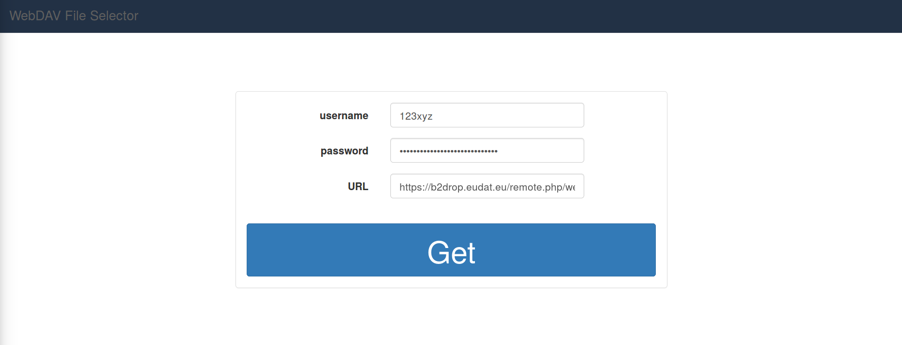
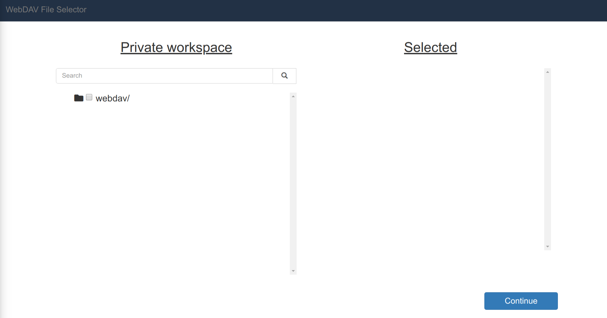
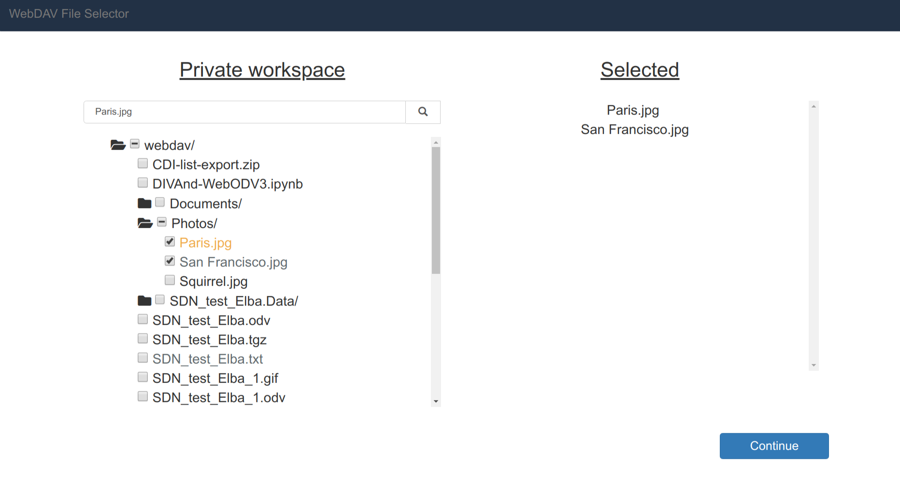

# webdav-fileselector

A Laravel package for showing and selecting files and folders of a WebDAV server. (Client usage is possible without Laravel.)

## Features

- Retrieve a list of files and folders from a WebDAV server
- Use WebDAV API: *propfind*
- No mounting
- Fast
- Supports multi-user
- Supports external usage as API
- Provides a sophisticated client template using the [hummingbird-treeview](https://github.com/hummingbird-dev/hummingbird-treeview) package
- Display files and folders in a hierarchical tree structure
- Different options can be enabled / disabled, e.g. 
  - select only one file
  - select one or more files
  - select whole folders
  - select all
- Filter for file types (e.g. .jpg, .txt) and arbitrary patterns
- Convenient search function
- ... and many more


## Dependencies

- Laravel 5.5.*
- PHP 7.0
- cURL extension enabled

## Included libraries

- jQuery 3.3.1
- bootstrap 3.3.7
- font-awesome
- hummingbird-dev/hummingbird-treeview

This means that these libraries (or parts of them) are included in the
webdav-fileselector package. Thus no download / installation of these libraries is needed.

## Getting started
### Installation

Install via composer and run the command below in the root of your project:

```bash
composer require hummingbird-dev/webdav-fileselector

```

Add the following under *autoload* to your composer.json (that one in your projects root directory):

``` php
...
"autoload": {
   ...
   "psr-4": {
      "App\\": "app/",
      "HummingbirdDev\\WebdavFileselector\\":"vendor/hummingbird-dev/webdav-fileselector/src/"
   }
   ...
},

```

Update *composer* from the root of your project:

```bash
composer update

```

Publish resources from your root folder:

```bash
php artisan vendor:publish --provider="HummingbirdDev\\WebdavFileselector\\WebdavFileselectorServiceProvider"

```


## Usage

Start a local development server

``` php
php artisan serve

```

and navigate to http://localhost:8000/webdav-fileselector

You will see the client template, which can be edited at "/resources/views/hummingbird-dev/client.blade.php".



Now insert your WebDAV username and password as well as the URL of the
WebDAV server. In this example I'm connecting with B2DROP from EUDAT, i.e. https://b2drop.eudat.eu/remote.php/webdav/.

After clicking on *Get* the *webdav-fileselector* will grab a list of
files and folders of your WebDAV storage. The [hummingbird-treeview](https://github.com/hummingbird-dev/hummingbird-treeview) package is used to display the data as a treeview structure and provides a convenient search function.



Click on the folder symbol to open the folder and select one or more files or folders. Or use the search function
to directly search for items.



The selected files are now shown in the list under "Selected". Of
course, that's not all, now you want to further process the selected
files, which will be discussed in the next section.


## Advanced usage

The *webdav-fileselector* uses the
[hummingbird-treeview](https://github.com/hummingbird-dev/hummingbird-treeview)
package, thus all methods from the *hummingbird-treeview* are
available.  In the */src/js/webdav-fileselctor.js* file the treeview
control starts with defining options of the treeview and the
initialization:

``` javascript
$.fn.hummingbird.defaults.collapsedSymbol= "fa-folder";
$.fn.hummingbird.defaults.expandedSymbol= "fa-folder-open";
$("#treeview").hummingbird();
...

``` 

Further below the functionality to retrieve the checked items as
well as the search function are implemented. Then there are several
commented functions, which can be uncommented for usage. 

### Get paths of selected files

The full paths of the selected files are stored in the *data-id* of
each treeview node. Thus if you want to download the files from the
WebDAV server you need these paths, which are available in the
*List.dataid* array of the function below. The names of the files and
folders are stored in *List.text* and are appended to the *#selection*
DOM element.

``` javascript
var List = {"id" : [], "dataid" : [], "text" : []};
$("#treeview").on("CheckUncheckDone", function(){
   List = {"id" : [], "dataid" : [], "text" : []};
   $("#treeview").hummingbird("getChecked",{list:List,onlyEndNodes:true});
   $("#selection").html(List.text.join("<br>"));
   //the full paths of the selected files are in the array List.dataid
   //console.log("Full WebDAV paths of the selected files: " + List.dataid)
});


```

### Restrict selection to one file

To restrict the selection to only a single file, we must first disable
the functionality of checking whole folders by using this option
before the initialization of the treeview:

``` javascript
...
$.fn.hummingbird.defaults.checkboxesGroups= "disabled";
$("#treeview").hummingbird();
...

```

Then we need to uncheck the old selection after every new
selection. Thus we need to extend the function from above to:

``` javascript
var List = {"id" : [], "dataid" : [], "text" : []};
$("#treeview").on("CheckUncheckDone", function(){
//------------------get ids and uncheck old selection---------------//
//------------------to restrict selection to one item---------------//
//------------------use the "checkboxesGroups" option above!--------//
   if (List.id != "") {
      $.each(List.id, function(i,e) {
 	     $("#treeview").hummingbird("uncheckNode",{attr:"id",name: '"' + e + '"',collapseChildren:false});
      });
   }
//------------------------------------------------------------------//
//------------------------------------------------------------------//
List = {"id" : [], "dataid" : [], "text" : []};
$("#treeview").hummingbird("getChecked",{list:List,onlyEndNodes:true});
$("#selection").html(List.text.join("<br>"));
//the full paths of the selected files are in the array List.dataid
//console.log("Full WebDAV paths of the selected files: " + List.dataid)
});

```

### Filtering

A common case is that only special file types are shown, e.g. image
files of type .jpg etc. Therefor we can use the *filter* method to
removes all files, which NOT match a search pattern.  Use "|" as a
seperator of search strings.  The *filter* method uses the *OR*
logic. For instance if *str=".txt|.jpg|test"* then only files, which
contain *.txt* or *.jpg* or *test* are shown in the treeview. Folders
are not affected by the *filter*:
  
``` javascript
$("#treeview").hummingbird("filter",{str: ".txt|.odv|.jpg|.zip"});

```

There are many more options provided by the *hummingbird-treeview*,
e.g. disabling the checking of certain nodes / files or automatically
checking nodes. Use this functionality for your needs.


## Automatization

It is possible to jump over the input form in the client by
automatically populating the fields and triggering the button. To this
the *.env* file in your project's root folder and the */conf/app.php*
file have to be edited. Add the WebDAV credentials to your *.env*:

``` php
...
webdav_username = 123xyz
webdav_password = hgTzH-HZTGh-KMiuj-MhrDf
webdav_url = https://b2drop.eudat.eu/remote.php/webdav/
webdav_auto = true
...

```

Now, add the env helpers to your */conf/app.php*:

``` php
...
'webdav_username' => env('webdav_username',''),
'webdav_password' => env('webdav_password',''),
'webdav_url' => env('webdav_url',''),
'webdav_auto' => env('webdav_auto', false),

...
```

If these credentials are set, the client form will automatically be
populated. If the *webdav_auto* variable is set to *true*, the client
form will be skipped and the connection to the WebDAV server will
automatically be established.


## Multi-user application

If you have a multi-user application you might want to retrieve the
WebDAV directory for every logged in user dynamically and not using
the static env variables. To this you can simply define the session variables:

``` php
$webdav_credentials = (object) array(
   "username" => "123xyz", 
   "password" => "HGfr-kJhG-UZhg", 
   "url" => "https://b2drop.eudat.eu/remote.php/webdav/"
);
session(['webdav_fileselector' => $webdav_credentials]);

``` 

before calling the *webdav-fileselector*. Note that it is
important to use exactly the names *webdav_fileselector* of the session variable and *username*, *password*, *url* for the array.


## External usage

### With HTML form client

There might be cases, where you want to provide the
*webdav-fileselector* to external users as a kind of API.  That means,
your Laravel application including the *webdav-fileselector* is
running on a public server. Now, a developer from another website can
make use of the functionality of your *webdav-fileselector*, in
principle by sending the WebDAV credentials and receiving the
directory list from the WebDAV server. The easiest way to achieve that
for the external developer is to implement the
*/src/views/client.blade.php* (from this package) in his own web
application. If the developers website is not a Laravel page, then the
Laravel parts, which are only the "{{" and the "}}" have to be
adapted. Further, the file has to be renamed to e.g. client.html. Now
look at the beginning of the *client.blade.php* and make sure that you
can load all needed CSS and JavaScript. That means, change Laravel
syntax to normal HTML. Probably you have also to adapt the
paths. However, all CSS and JavaScript loaded here is included in the
*webdav-fileselector* package. Now look at the form and adapt the
*value="{{ ... }}"* parts. Either leave them empty or populate them by
your own methods. At the bottom of the *client.blade.php* file you
will find a small JavaScript part, which can be removed or has to be
adapted, if automatization (see above) will be used.

The client is now ready for production at the external website, but
now the connection to your *webdav-fileselector* API has to be
realized. Nothing easier than that. So you have simply to edit the
*/src/js/webdav-fileselector.js* file. Change the *url* entry from the
AJAX call:

``` javascript
function getb2drop_ajax(data) {
   $.ajax({
   type: "POST",
   url: proxy + '/webdav-fileselector',
   ...

```

to your service at the public server, e.g.:

``` javascript
function getb2drop_ajax(data) {
   $.ajax({
   type: "POST",
   url: 'https://example.com/webdav-fileselector',
   ...

``` 

Don't forget to adapt possibly the path to load the
*hummingbird-treeview* in the JavaScript file *webdav-fileselector.js*:

``` javascript
$(document).ajaxComplete(function(e,xhr,settings){
   if (settings.func=="getb2drop_complete") {
      var result = JSON.parse(xhr.responseText);
      $("#waiting_anim").hide();	     
      $(".result").show();
      $("#result").html(result.join(" "));
      $.getScript(proxy + '/js/webdav-fileselector-js/hummingbird-treeview.js').done(function(){


```

Finally make sure that the external page is allowed to access your
*webdav-fileselector* by setting the appropriate header in the Laravel
controller. This can be controlled via the *.env* in your project's root.
Set 

``` php
...
webdav_access = all
...

```

to allow all pages access or a single page:

``` php
...
webdav_access = https://www.external.com
...

```

Now, add the env helper to your */conf/app.php*:

``` php
...
'webdav_access' => env('webdav_access', false),
...

```

with *false* as default value, which means that the page is prevented
by the same-origin policy and access from other external pages is not allowed.


### Without HTML form client

It is also possible to use the *webdav-fileselector* from an external
site automatically without using the HTML form. However we still want
to use here the *hummingbird-treeview* package to display the WebDAV
directory structure. That means you still need to load all the CSS and
JavaScript shown in the *client.blade.php* similar to above. So, what
you essentially need is the *client.blade.php* without the whole HTML form part and
the *webdav-fileselctor.js*. The workflow
would look like this. A user comes to the external website and
navigates to e.g. *https://example.com/webdav-fileselector*. Because
the user is logged in, the application knows the user's WebDAV
credentials and pushes these to JavaScript. Now in your JavaScript you
create an object, which receives the credentials and will be passed to the
AJAX function.

``` javascript
var data = {"username" : your_webdav_user_name, "password" : your_webdav_password, "url" : your_webdav_url};
getb2drop_ajax(data);

```

The result is then shown in your HTML.


### Bare-bones AJAX

Finally a running *webdav-fileselector* on a public server can be
queried by a minimal HTTP POST request. In your external website you
need the following AJAX snippet:

``` javascript
var data = {"username" : your_webdav_user_name, "password" : your_webdav_password, "url" : your_webdav_url};

$.ajax({
   type: "POST",
   url: 'https://your_website.com/webdav-fileselector',
   data: data,
   dataType: "json",
   func: "getb2drop_complete",                                 
   cache: "false",
});

$(document).ajaxComplete(function(e,xhr,settings){
   if (settings.func=="getb2drop_complete") {
      var result = JSON.parse(xhr.responseText);
	  console.log(result)
   }
});

```

The response is the users WebDAV directory structure formatted to be usable with the *hummingbird-treeview*:

``` html
<div class="hummingbird-treeview-converter" data-height="400px" data-scroll="true">
<li data-id="/remote.php/webdav/">webdav/</li>
<li data-id="/remote.php/webdav/CDI-list-export.zip">-CDI-list-export.zip</li>
<li data-id="/remote.php/webdav/DIVAnd-WebODV3.ipynb">-DIVAnd-WebODV3.ipynb</li>
<li data-id="/remote.php/webdav/Documents/">-Documents/</li>
<li data-id="/remote.php/webdav/Documents/Example.odt">--Example.odt</li>
<li data-id="/remote.php/webdav/Photos/">-Photos/</li>
<li data-id="/remote.php/webdav/Photos/Paris.jpg">--Paris.jpg</li>
<li data-id="/remote.php/webdav/Photos/San%20Francisco.jpg">--San%20Francisco.jpg</li>
<li data-id="/remote.php/webdav/Photos/Squirrel.jpg">--Squirrel.jpg</li>
</div>
```

### Bare-bones HTML form

Of course you can use a simple HTML form to query the service:

``` html
<!doctype html>
<html>
    <body>
	<form method="POST" action="http://localhost:8000/webdav-fileselector">
	    Username:<br>
	    <input type="text" name="username" value="">
	    <br>
	    Password:<br>
	    <input type="password" name="password" value="">
	    <br>
	    URL:<br>
	    <input id="url" type="text" name="url" value="">
	    <br><br>
	    <input type="submit" value="Submit">
	</form>
    </body>
</html>

```


### Bare-bones cURL

Another minimal option is using cURL:

``` shell
curl -X POST "http://localhost:8000/webdav-fileselector" -H "Content-Type: application/x-www-form-urlencoded" 
-d "username=123xyz&password=juzH-UHZt-OIkj&url=https://b2drop.eudat.eu/remote.php/webdav/"

```

